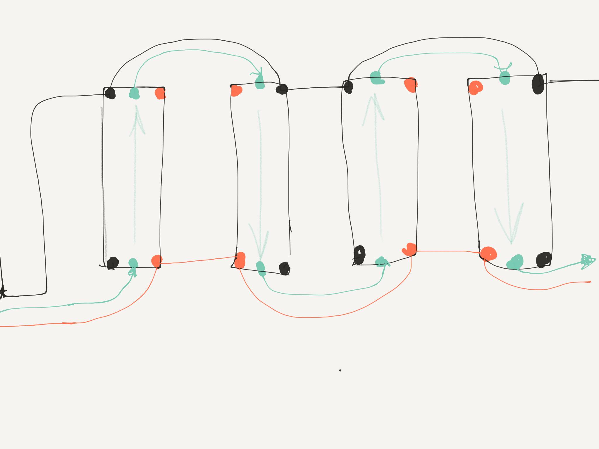
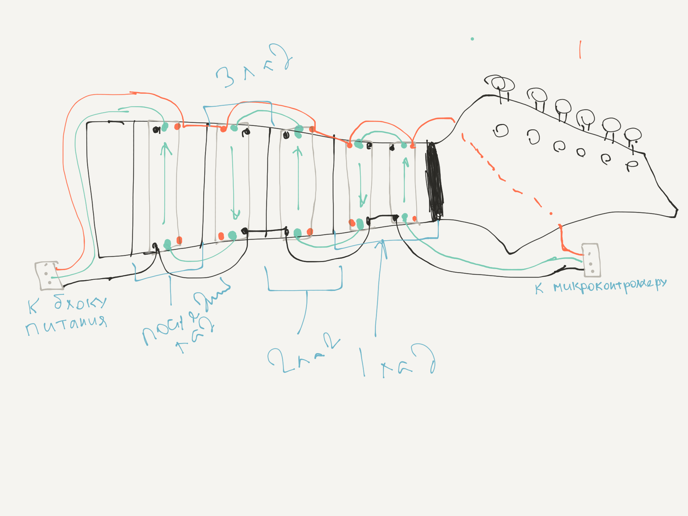

Обширная статья со всеми деталями: https://learn.adafruit.com/adafruit-neopixel-uberguide?view=all#basic-connections


- Обязателен конденсатор на 1000mF 6.3V+, встроенный в цепь питания (между красным и черным проводом с соблюдением полярности).
- Обязателен резистор на 300-500Ohm (470 норм) на линии данных (зеленый провод).


Очень важно соблюдать порядок отключения/подключения ленты к контроллеру во избежание повреждения светодиодов.

## Порядок подключения ленты к контроллеру:
1. Черный провод (земля)
2. Красный провод (+5V)
3. Зеленый провод (данные)

## Порядок отключения ленты:
1. Зеленый провод (данные)
2. Красный провод (+5V)
3. Черный провод (земля)






```
[20:38, 18.9.2017] Me: Самое главное - именно так завести провода на головке грифа, там где колки.                        
[20:38, 18.9.2017] Me: Т.е. чтобы 2 снизу - масса + данные, а +5V красный сверху.                        
[20:39, 18.9.2017] Me: Провода выглядываю тсхмеаитчно, чтобы было понятнее. По факту - они должны быть заподлицо, т.е. чтобы не задевались пальцами, были полностью погружены в дерево.                        
[20:39, 18.9.2017] Me: Там прорези наверное надо будет чем-то залить, чтобы не сырело и не окислялось. Но так чтобы в случае ремонта можно было добраться.                        
[20:40, 18.9.2017] Me: Что-то типа канифоли, которую если что можно выплавить не сжигая дерева, но чтобы при обычной температуре твердой была.                        
[20:40, 18.9.2017] Me: Контроллер будет на обратной стороне головки грифа крепиться. Вот туда надо будет вывести провода с коннектором.                        
[20:40, 18.9.2017] Me: Коннекторы есть.                        
[20:41, 18.9.2017] Me: С другого конца грифа, который крепится к гитаре - тоже надо вывести коннектор. Там будет блок питания, который запитает и свет и контроллер на другом конце.                        
[20:42, 18.9.2017] Me: На грифе провода могут выходить наружу дерева только за нулевым пластиковым порожком, не раньше.                        
[20:45, 18.9.2017] Me: И я думаю, что там, где они будут выходить, изоляцию лучше не сдирать - чтобы + и - не коротнуло. Без изоляции они нужны только внутри грифа. Ну или термоусадкой потом сверху насадим.                        
[20:46, 18.9.2017] Me: Все это есть.                        
[20:47, 18.9.2017] Brother: Ок. Готовь сумку😁                        
[20:49, 18.9.2017] Me: Да, utp 5e должен подойти, по сопротивлению 8Ом на 100м, для 10А max, которые будут при полной нагрузке нужно чтобы сопротивление было не больше 0.5Ом, в случае с 1м будет 0.08, в пределы вроде укладываемся.                        
[20:49, 18.9.2017] Me: Будет тебе сумка. :)                        
[20:50, 18.9.2017] Me: Светодиоды где гриф расширяется думаю надо к нижнему краю чуть смещать, т.к. взгляд будет направлен сверху. Сделаю риски, где визуально должен быть центр.                        
[20:50, 18.9.2017] Brother: Как будет гриф на руках гляну как удобнее все сделать🙂                        
[20:51, 18.9.2017] Brother: По ходу работы буду делать фото и видео обзоры                        
[20:51, 18.9.2017] Me: Да, обязательно, пожалуйста. Т.к. хочу в статью это оформить.
```
